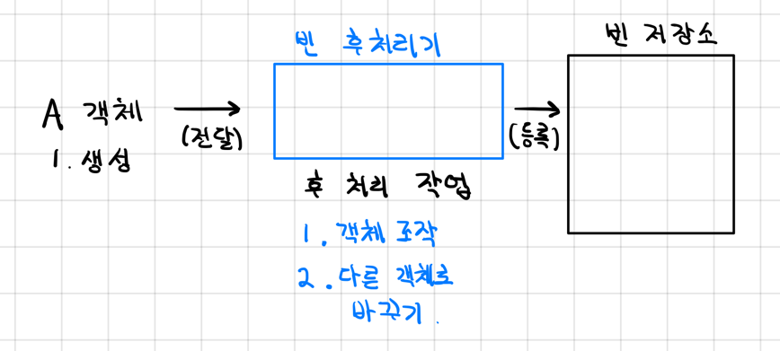
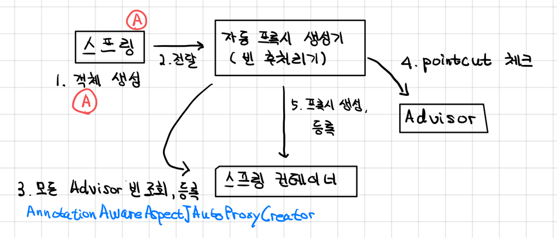

# 빈 후처리기

## 배경
- 객체를 생성하고 스프링 컨테이너 내부의 빈 저장소에 등록한다.
- 빈 저장소에 등록하기 직전에 객체를 조작하고 싶다면 빈 후처리기를 사용하면 된다.
- 빈 후처리기: `BeanPostProcessor`

## 기능
- 빈 저장소에 객체를 등록하기 전, 객체를 조작할 수도 있고, 다른 객체로 바꿔치기 하는 것도 가능하다.


- 일반적으로 스프링 빈을 등록할 땐 위 처럼 객체를 생성하고 바로 빈 저장소에 등록한다.



- 빈 후처리기는 스프링 빈을 등록하기 전에 위 그림 처럼 빈 저장소 등록 전 특정 작업을 지정할 수 있다.

## 예시

- 테스트 코드: src/test/java/com/hello/proxy/postprocessor/BeanPostProcessorTest.java

### 설명

```java
@Configuration
static class BeanPostProcessorConfig {
    
    // ...

    @Bean
    public AToBPostProcessor helloPostProcessor() {
        return new AToBPostProcessor();
    }
}

@Slf4j
static class AToBPostProcessor implements BeanPostProcessor {
    @Override
    public Object postProcessAfterInitialization(Object bean, String beanName) throws BeansException {
        log.info("beanName={} bean={}", beanName, bean);
        if (bean instanceof A) {
            return new B();
        }

        return bean;
    }
}
```

- `AToBPostProcessor`를 빈으로 등록한다.
- `AToPostProcessor`는 빈 등록 과정에서 실행되며 A 객체를 등록하기 전에 B 객체로 바꾼다.

> @PostConstruct의 비밀
> - @PostConstruct는 스프링 빈 생성 이후에 빈을 초기화 하는 역할을 한다.
> - 스프링에서는 `CommonAnnotationBeanPostProcessor`라는 빈 후처리기를 자동으로 등록하는데,
> - 여기에서 `@PostConstruct` 애노테이션이 붙은 메서드를 호출한다.

## 스프링이 제공하는 빈 후처리기

- 코드 예시: com/hello/proxy/config/v5_autoproxy/AutoProxyConfig.java

```text
implementation 'org.springframework.boot:spring-boot-starter-aop'
```
- 스프링이 제공하는 빈 후처리기를 위해서 위 라이브러리 의존성을 추가해주어야 한다.
- 위 라이브러리를 추가하면 `aspectJ` 관련 라이브러리를 등록하고 스프링 부트가 AOP 관련 클래스를 자동으로 스프링 빈에 등록한다.
  - 스프링 부트 자동 설정으로 `AnnotationAwareAspectJAutoProxyCreator`라는 빈 후처리기가 스프링 빈에 자동 등록된다.
  - 이 빈 후처리기는 스프링 빈으로 등록된 Advisor들을 자동으로 찾아서 프록시가 필요한 곳에 자동으로 프록시를 적용해준다.
  - 추가로 `@AspectJ`와 관련된 AOP 기능도 자동으로 찾아서 처리해준다.



